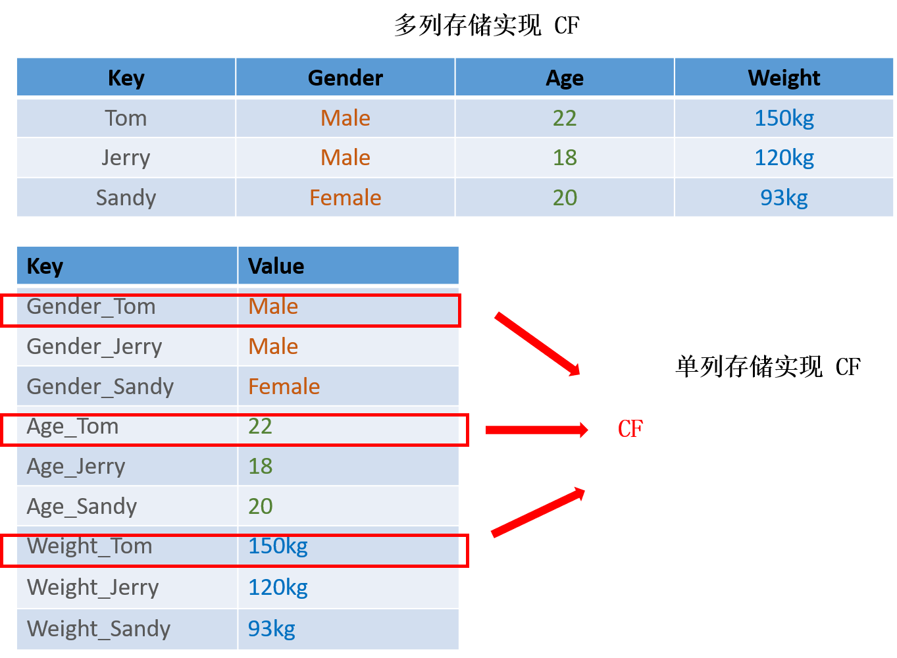
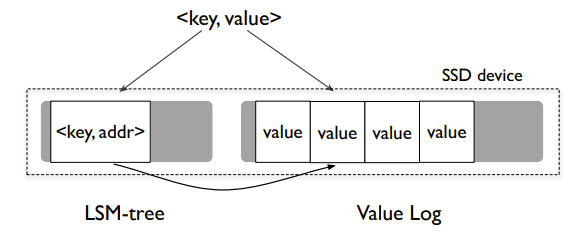

[TOC]

# Project1

Project1 没有设计到分布式，其要求我们实现 `单机` 的存储引擎，并保证其支持 CF。不同于 TiKV 使用的 RocksDB，TinyKV 采用的底层存储为 BadgerDB，虽然同样是基于 LSM 的，但后者不支持 CF，故这里需要自己实现。所谓 CF，就是把同类型的值归结在一起，这在多列存储（比如 MYSQL）中很显然，一列就是一个 CF。但是 KV 是单列存储的，因为为了实现 CF，必须通过单列来模拟多列，方法很简单，就是在 Key 前面拼上 CF 前缀。如下图：



也就是说，只需要给每一个 Key 加上对应的前缀，就能模拟出多列的效果，从而实现 CF。在 TinyKV 中，一共只有三个 CF，分别为 Default、Lock、Write，三个 CF 用于实现 Project4 的 2PC，这里暂时不用理解。前缀拼接无需自己实现，直接调用项目给的 `KeyWithCF` 即可，其余和 CF 有关的方法也都在 engine_util 中已经提供好了。


## Badger

在开始编写代码之前，可以先了解一下 Badger。Badger 采用的也是 LSM-Tree 结构。但不同于传统的存储结果，它参考了 WiscKey 的设计，仅仅将 <Key - ValueAddr> 存入 LSM-Tree 中，而 Value 则无序的存放在磁盘中。由于 <Key - ValueAddr> 是很小的，所以这一部分数据完全可以放在内存中，以至于读取 Key 是根本无需访问磁盘，读取某一个 Key 的 Value 时也仅仅需要访问一次磁盘。WicsKey 的设计如下图所示：



Value Log 是存放在磁盘中的，且没有进行排序，即直接 append，这样的化就避免了写放大的问题，因此写的时候比传统的 LSM 结构要更快。但是这么做是有代价的，那就是 scan。因为 Value Log 是无序的，因此当 scan 某一个范围的数据时，会涉及大量的随机读，影响性能。

## Project1A

> Implement a standalone storage engine.

在这一节中，需要完善`kv/storage/standalone_storage/standalone_storage.go` 的代码，实现 storage engine 的初始化。在函数 `NewStandAloneStorage` 中，我们需要初始化一个包含 engine 的 storage。先生成 KV 路径和 Raft 路径，二者的基目录 dbPath 直接从 conf 中取即可。然后调用两次 `CreateDB`，因为其中已经封装了 `MkdirAll `，故不需要另行创建目录。`CreateDB` 执行完后，会返回 *DB，接着用 `NewEngines` 生成引擎即可。

``` go
store := StandAloneStorage{
    engine: engine_util.NewEngines(kvEngine,raftEngine,kvPath,raftPath),
    config: conf,
}
return &store
```

Storage 是 badger K-V 存储的一层封装，其中含有读写方法，分别为 Write 和 Reader。不一样的是，Write 会直接将传入的操作写入，而 Reader 需要先返回一个 StorageReader，然后通过 StorageReader 执行读操作，而不是直接读。

``` go
type Storage interface {
    // Other stuffs
    Write(ctx *kvrpcpb.Context, batch []Modify) error
    Reader(ctx *kvrpcpb.Context) (StorageReader, error)
}
```

首先我们实现 Reader 方法，该方法返回一个 StoreageReader 接口，而这个接口是需要我们手动实现的。该接口有三个方法：`GetCF`、`IterCF`、`Close`。作用分别为：

- 从 engine 中获取 CF_Key 对应的 value；
- 获取对应 CF 的迭代器；
- 关闭该 Reader；

为了实现StoreageReader，这里需要定义一个含有字段 txn 的结构，我将其命名为 StandAloneReader，接着让其实现上述三个方法即可。前两者在 engine_util 中已经实现，直接封装就行，`Close` 直接调用 txn 的 `DisCard` 即可。三者的代码如下：

``` go
func (s *StandAloneReader) GetCF(cf string, key []byte) ([]byte, error){
	value, err := engine_util.GetCFFromTxn(s.kvTxn,cf,key)
	if err == badger.ErrKeyNotFound {
		return nil, nil
	}
	return value,err
}

func (s *StandAloneReader) IterCF(cf string) engine_util.DBIterator{
	return engine_util.NewCFIterator(cf,s.kvTxn)
}

func (s *StandAloneReader) Close() {
	s.kvTxn.Discard()
	return
}
```

Reader 实现完毕后，需要实现 Write 方法。该方法不同于 Reader 返回一个接口，而是直接执行写操作。需要注意的是，写操作都是 `批处理`，每一个写操作都依赖于结构 Modify，类型分为 Put 和 Delete。每次执行都是批量执行，依赖于切片 batch。因此，Write 以 batch 为核心入参，遍历其中的每一个 Modify，判断其是 Put 还是 Delete，随后通过 engine_util 中的 API 进行写入即可。核心代码如下：

``` go
	for _,b := range batch {
		switch b.Data.(type) {
		case storage.Put:
			put := b.Data.(storage.Put)
			key := put.Key
			value := put.Value
			cf := put.Cf
			err := engine_util.PutCF(s.engine.Kv,cf,key,value)
			if err != nil{
				return err
			}
			break
		case storage.Delete:
			del := b.Data.(storage.Delete)
			key := del.Key
			cf := del.Cf
			err := engine_util.DeleteCF(s.engine.Kv,cf,key)
			if err != nil{
				return nil
			}
			break
		}
	}
```

## Project1B

> Implement raw key-value service handlers.

上一节实现了单机的 storage engine，在该节中我们需要对其进行一层封装，实现一个 K-V service handler，让读写操作以 API 的方式暴露出去供上层使用。这里要完善代码 `kv/server/raw_api.go`，其中包括 `RawGet` 、`RawScan`、`RawPut`、`RawDelete`。四者作用分别为：

- 获取对应 CF_Key 的 Value；
- 在指定的 CF 中，从 StartKey 开始扫描 KvPair，上限为 Limit；
- 写入一个 KvPair；
- 删除一个 KvPari；

首先是 `RawGet` 和 `RawScan`，二者都是读操作，通过 storage 的 Reader 来执行读。首先，通过 `server.storage.Reader()` 获取到 reader。如果是 RawGet，那么通过 `reader.GetCF()` 直接获取到值，然后包装成 resp 返回回去。如果是 RawScan，那么通过 `reader.RawScan()` 先获取到迭代器，接着按照 StartKey 开始遍历，将遍历到的 K-V 整合起来即可，遍历时要注意 Limit 限制，整合完成后依然包装成 resp 返回回去。需要注意的是，如果 RawGet 没有获取到，那么返回时要标记 `resp.NotFound = true`。

`RawPut` 和 `RawDelete` 两者实现非常相似，都是将请求包装成 Modify 的 batch，然后通过 `server.storage.Write()` 执行写操作，最后把执行的结果包装成 resp 返回回去即可。二者的 Modify 有所不同，如下：

``` go
// Put
put := storage.Put{
    Key: req.Key,
    Value: req.Value,
    Cf: req.Cf,
}
modify := storage.Modify{
    Data: put,
}
// Delete
del := storage.Delete{
    Key: req.Key,
    Cf: req.Cf,
}
modify := storage.Modify{
    Data: del,
}
```

